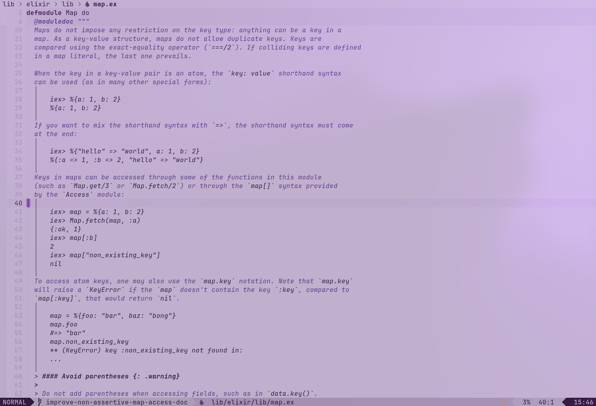
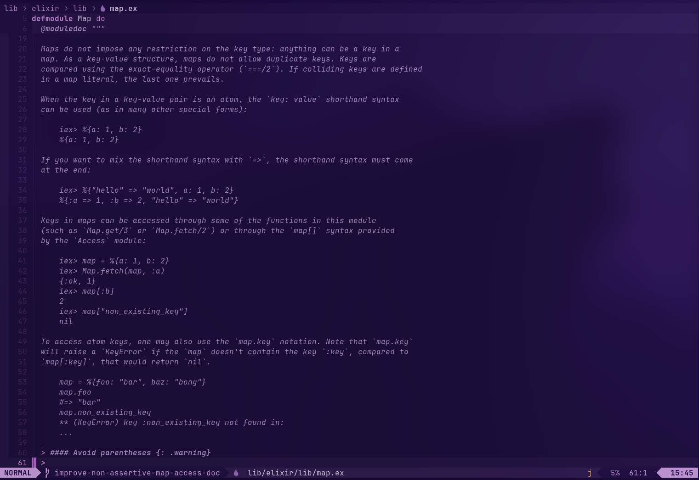

<div align="center">
      <h1>arcanum-elixir.nvim</h1>
      <p><em>A mystical purple colorscheme inspired by Elixir's magic for both light and dark mode coding</em></p>
      <p><strong>🌅 Light Theme</strong> • <strong>🌙 Dark Theme</strong></p>
      <p>Optimized for comfortable development in any lighting condition</p>
</div>

<p align="center"> 
      <a href="#"></a>
</p>

## 📸 Preview

<div align="center">
  
  <table>
    <tr>
      <td align="center">
        <h3>🌅 Light Theme</h3>
        
      </td>
      <td align="center">
        <h3>🌙 Dark Theme</h3>
        
      </td>
    </tr>
  </table>
  
  <p><em>ArcanumElixir.nvim in action - mystical purple tones creating the perfect magical coding atmosphere in any lighting condition</em></p>
  
</div>

## 🔮 About ArcanumElixir

**arcanum-elixir.nvim** is a mystical Neovim colorscheme available in both light and dark themes. Created for developers who value both functionality and magical aesthetic elegance, ArcanumElixir transforms the familiar earthtone palette into a refined purple experience inspired by Elixir's mystical powers.

**🌅 Light Theme:** ArcanumElixir's light theme is designed for bright environments, achieving the intended mystical coding atmosphere inspired by ancient arcane manuscripts.

**🌙 Dark Theme:** The dark theme maintains the same purple harmony and mystical elegance, carefully adapted for low-light environments while preserving the arcane aesthetic.

### 🎨 Design Philosophy

ArcanumElixir draws its inspiration from the **mystical purple tones** of **Elixir**, which uses enchanting, magical colors that reduce eye strain during extended coding sessions. This same principle applies to development - the purple palette creates a comfortable, mystical atmosphere perfect for long coding sessions, research, and thoughtful programming.

**Why purple tones for both light and dark?**
- **Reduced eye fatigue** during extended coding sessions in any lighting condition
- **Mystical ambiance** reminiscent of ancient arcane manuscripts and magical libraries  
- **Professional appearance** suitable for magical and alchemical environments
- **Enchanting, inviting atmosphere** that encourages focused spellcasting
- **Adaptable** - Light theme for bright environments, dark theme for low-light settings
- **Consistent aesthetic** - Both themes maintain the same arcane character

### ✨ Key Features

- **Dual theme support** - Light and dark themes
- **Based on gruvbox.nvim** - Inherits the robust architecture and reliability
- **Purple color palette** - Mystical, arcane tones inspired by Elixir
- **Full treesitter support** - Enhanced syntax highlighting
- **LSP semantic highlights** - Modern language server integration
- **Customizable** - Extensive configuration options
- **Mystical focus** - Perfect for research, documentation, and magical coding
- **Light/Dark harmony** - Both themes share the same arcane aesthetic principles

## 🔧 Requirements

- Neovim 0.8.0+

## 📦 Installation

### Using `lazy.nvim` (recommended)

```lua
{
  "abreujp/arcanum-elixir.nvim",
  priority = 1000,
  config = function()
    require("arcanum_elixir").setup({
      -- your configuration here
    })
    
    -- For light theme
    vim.o.background = "light"
    vim.cmd("colorscheme arcanum_elixir")
    
    -- OR for dark theme
    -- vim.o.background = "dark"
    -- vim.cmd("colorscheme arcanum_elixir")
  end,
}
```

### Using `packer`

```lua
use {
  "abreujp/arcanum-elixir.nvim",
  config = function()
    require("arcanum_elixir").setup()
    
    -- Choose your preferred theme
    vim.o.background = "light"
    vim.cmd("colorscheme arcanum_elixir")
    
    -- OR use: 
    -- vim.o.background = "dark"
    -- vim.cmd("colorscheme arcanum_elixir") for dark theme
  end
}
```

### Using `vim-plug`

```vim
Plug 'abreujp/arcanum-elixir.nvim'
```

Then in your init.vim:
```vim
" For light theme
set background=light
colorscheme arcanum_elixir

" OR for dark theme
" set background=dark
" colorscheme arcanum_elixir
```

## 🚀 Quick Start

### Lua Configuration

```lua
require("arcanum_elixir").setup({
  contrast = "soft",  -- "hard", "soft" or "" (default)
  transparent_mode = false,
})

-- Choose your preferred theme
vim.o.background = "light"
vim.cmd("colorscheme arcanum_elixir")

-- OR for dark theme
-- vim.o.background = "dark"
-- vim.cmd("colorscheme arcanum_elixir")
```

### Vim Configuration

```vim
" For light theme
set background=light
colorscheme arcanum_elixir

" OR for dark theme
" set background=dark
" colorscheme arcanum_elixir
```

## ⚙️ Configuration

ArcanumElixir provides extensive customization options while maintaining sensible defaults:

```lua
require("arcanum_elixir").setup({
  terminal_colors = true,     -- Enable terminal colors
  undercurl = true,          -- Enable undercurls for diagnostics
  underline = true,          -- Enable underlines
  bold = true,               -- Enable bold text
  italic = {
    strings = true,          -- Italicize strings
    emphasis = true,         -- Italicize emphasized text
    comments = true,         -- Italicize comments
    operators = false,       -- Don't italicize operators
    folds = true,           -- Italicize fold text
  },
  strikethrough = true,      -- Enable strikethrough
  invert_selection = false,  -- Don't invert selections
  invert_signs = false,      -- Don't invert sign column
  invert_tabline = false,    -- Don't invert tabline
  inverse = true,            -- Invert background for search, diffs, etc.
  contrast = "",             -- Contrast level: "hard", "soft", or ""
  palette_overrides = {},    -- Override palette colors
  overrides = {},            -- Override highlight groups
  dim_inactive = false,      -- Don't dim inactive windows
  transparent_mode = false,  -- Disable transparent background
})
```

**⚠️ Important:** Always call `setup()` before setting the colorscheme!

### Palette Customization

Override specific colors while maintaining the sepia harmony:

```lua
require("arcanum_elixir").setup({
  palette_overrides = {
    bright_red = "#CC6666",    -- Custom error color
    gray = "#999999",          -- Custom comment color
  }
})
```

### Highlight Group Overrides

Customize specific highlighting:

```lua
require("arcanum_elixir").setup({
  overrides = {
    -- UI elements
    SignColumn = { bg = "#F5F5DC" },
    
    -- Treesitter groups
    ["@comment.lua"] = { fg = "#8B7355", italic = true },
    ["@string"] = { fg = "#8B6F47" },
    
    -- LSP semantic tokens
    ["@lsp.type.method"] = { fg = "#A0623A", bold = true },
  }
})
```

## 🎨 Acknowledgments

**arcanum-elixir.nvim** is built upon the excellent foundation of [gruvbox.nvim](https://github.com/ellisonleao/gruvbox.nvim) by [@ellisonleao](https://github.com/ellisonleao). The robust architecture and thoughtful design of gruvbox made ArcanumElixir possible.

**Color inspiration** comes from the mystical purple tones of the [Elixir](https://elixir-lang.org/) programming language, which demonstrates how enchanting, magical colors can reduce eye strain and create a comfortable coding environment.

## 📄 License

MIT License - see [LICENSE](LICENSE) for details.
